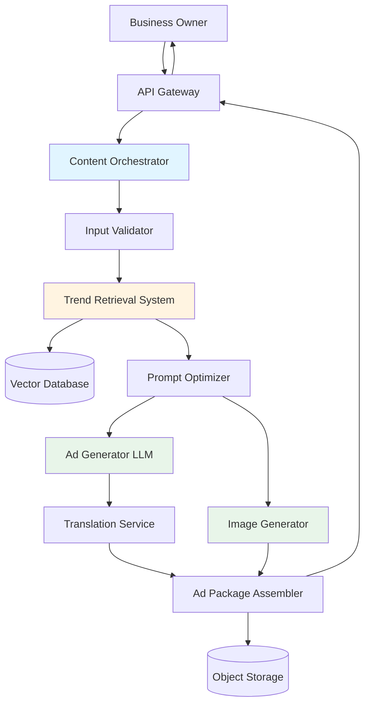

# Design Document: HyperLocal AI Content Engine

## Overview

The HyperLocal AI Content Engine is a microservices-based system that generates culturally relevant, multilingual marketing content for small businesses in India. The system orchestrates multiple AI models (LLM for text generation, image generation, translation) with a RAG-based trend retrieval system to produce complete ad packages tailored to specific cities and regional languages.

The architecture follows a pipeline pattern where user input flows through validation, trend enrichment, prompt optimization, parallel content generation, and final packaging stages. The system prioritizes speed (30-second total generation time) while maintaining quality through prompt optimization and retry mechanisms.

### Key Design Decisions

1. **Microservices Architecture**: Each major component (Ad Generator, Image Generator, Translation Service, Trend Retrieval) is a separate service for independent scaling and model updates
2. **RAG for Hyper-Local Context**: Vector database stores city-specific trends, festivals, and cultural preferences for contextual enrichment
3. **Parallel Generation**: Text and image content are generated concurrently to minimize total latency
4. **Graceful Degradation**: System continues with reduced functionality if non-critical components fail (e.g., trend retrieval)
5. **Prompt Engineering Layer**: Dedicated service optimizes prompts before sending to AI models to improve output quality

## Architecture



### Component Interaction Flow

1. **Input Phase**: User submits product details, city, and language through API Gateway
2. **Validation Phase**: Input Validator checks format, size limits, and supported values
3. **Enrichment Phase**: Trend Retrieval System fetches hyper-local context from Vector Database
4. **Optimization Phase**: Prompt Optimizer enhances prompts with context and language-specific instructions
5. **Generation Phase**: Ad Generator and Image Generator work in parallel
6. **Translation Phase**: Translation Service processes text content if needed
7. **Assembly Phase**: Ad Package Assembler combines all outputs and uploads to storage
8. **Delivery Phase**: API returns download links and preview data to user

## Components and Interfaces

### 1. API Gateway

**Responsibility**: Entry point for all client requests, handles authentication, rate limiting, and request routing.

**Interface**:
```typescript
interface ContentGenerationRequest {
  productDescription: string;      // Min 10 chars
  targetCity: string;               // Must be in supported cities list
  targetLanguage: string;           // Must be in supported languages list
  productImage?: File;              // Optional, max 10MB, JPEG/PNG/WebP
  productCategory?: string;         // Optional, helps with trend matching
}

interface ContentGenerationResponse {
  requestId: string;
  status: 'completed' | 'failed' | 'partial';
  adPackage?: AdPackage;
  errors?: ErrorDetail[];
  generationTimeMs: number;
}

interface AdPackage {
  poster: ImageAsset;
  caption: string;                  // Max 150 chars
  hashtags: string[];               // 5-10 items
  voiceScript: string;              // ~30 seconds spoken
  whatsappText: string;             // Max 1000 chars
  language: string;
  city: string;
}
```

### 2. Content Orchestrator

**Responsibility**: Coordinates the entire content generation pipeline, manages parallel execution, and handles retries.

**Interface**:
```typescript
interface Orchestrator {
  generateContent(request: ContentGenerationRequest): Promise<ContentGenerationResponse>;
  retryFailedComponent(requestId: string, component: string): Promise<void>;
}

class ContentOrchestrator implements Orchestrator {
  async generateContent(request: ContentGenerationRequest): Promise<ContentGenerationResponse> {
    // 1. Validate input
    // 2. Fetch trends (with timeout)
    // 3. Optimize prompts
    // 4. Generate content in parallel (text + image)
    // 5. Assemble package
    // 6. Return result
  }
}
```

**Retry Logic**: Up to 3 attempts with exponential backoff (1s, 2s, 4s) for AI model calls.

### 3. Input Validator

**Responsibility**: Validates all user inputs against requirements and supported configurations.

**Interface**:
```typescript
interface Validator {
  validateRequest(request: ContentGenerationRequest): ValidationResult;
}

interface ValidationResult {
  isValid: boolean;
  errors: ValidationError[];
}

interface ValidationError {
  field: string;
  message: string;
  messageInLanguage?: string;  // Translated error message
}
```

**Validation Rules**:
- Product description: 10-500 characters
- Target city: Must exist in supported cities list
- Target language: Must exist in supported languages list
- Product image: Max 10MB, valid image format
- File format validation using magic number detection

### 4. Trend Retrieval System (RAG)

**Responsibility**: Fetches hyper-local trends, cultural context, and seasonal information relevant to the target city and product category.

**Interface**:
```typescript
interface TrendRetrieval {
  fetchTrends(city: string, category?: string): Promise<TrendContext>;
}

interface TrendContext {
  city: string;
  currentFestivals: Festival[];
  localTrends: Trend[];
  culturalPreferences: CulturalContext;
  dataFreshness: Date;
  fallbackLevel: 'city' | 'state' | 'region' | 'national';
}

interface Trend {
  topic: string;
  relevanceScore: number;
  source: string;
  timestamp: Date;
}
```

**Implementation Details**:
- Vector database (e.g., Pinecone, Weaviate) stores embeddings of trend data
- Semantic search retrieves top 5-10 relevant trends
- Fallback hierarchy: City → State → Region → National
- Cache frequently accessed city trends (TTL: 6 hours)
- Background job updates trend data daily

### 5. Prompt Optimizer

**Responsibility**: Enhances raw prompts with context, language instructions, and style guidelines to improve AI model output quality.

**Interface**:
```typescript
interface PromptOptimizer {
  optimizeForAdGeneration(
    basePrompt: string,
    context: TrendContext,
    language: string
  ): OptimizedPrompt;
  
  optimizeForImageGeneration(
    basePrompt: string,
    context: TrendContext,
    style: ImageStyle
  ): OptimizedPrompt;
}

interface OptimizedPrompt {
  prompt: string;
  systemInstructions?: string;
  temperature: number;
  maxTokens: number;
}
```

**Optimization Strategies**:
- **For Text Generation**: Add language-specific tone instructions, incorporate trend keywords, specify output format
- **For Image Generation**: Add Indian aesthetic guidelines (colors, patterns), incorporate cultural symbols, specify composition rules
- **Context Injection**: Seamlessly weave trend data into prompts without explicit "use these trends" instructions

### 6. Ad Generator (LLM)

**Responsibility**: Generates ad copy, captions, hashtags, voice scripts, and WhatsApp text using a multilingual LLM.

**Interface**:
```typescript
interface AdGenerator {
  generateAdContent(
    prompt: OptimizedPrompt,
    language: string
  ): Promise<AdContent>;
}

interface AdContent {
  caption: string;
  hashtags: string[];
  voiceScript: string;
  whatsappText: string;
  generatedInLanguage: string;
}
```

**Model Selection**:
- Use multilingual models like GPT-4, Claude, or Gemini with strong Indic language support
- Alternative: Fine-tuned models on Indian advertising data for better cultural relevance
- Fallback: Generate in English, then translate using Translation Service

**Prompt Structure**:
```
System: You are an expert Indian marketing copywriter specializing in {language} content for small businesses.

User: Create compelling ad content for:
Product: {productDescription}
Location: {city}
Language: {language}
Local Context: {trendContext}

Generate:
1. Social media caption (max 150 chars)
2. 5-10 hashtags (mix of {language} and English)
3. 30-second voice ad script
4. WhatsApp promotion message (max 1000 chars)

Style: Conversational, culturally relevant, action-oriented
```

### 7. Image Generator

**Responsibility**: Creates poster designs incorporating product information, cultural aesthetics, and optional user-provided images.

**Interface**:
```typescript
interface ImageGenerator {
  generatePoster(
    prompt: OptimizedPrompt,
    productImage?: File
  ): Promise<GeneratedImage>;
}

interface GeneratedImage {
  imageUrl: string;
  format: 'png';
  dimensions: { width: 1080, height: 1080 };
  generationTimeMs: number;
}
```

**Model Selection**:
- DALL-E 3, Midjourney API, or Stable Diffusion XL
- Consider Indian-specific fine-tuned models for better cultural representation
- Image composition: Product-focused with vibrant colors typical of Indian advertising

**Prompt Engineering for Images**:
```
A professional social media poster for {productDescription}, 
Indian aesthetic with vibrant colors, 
{culturalElements from trends}, 
modern design, clean layout, 
suitable for {city} audience,
1:1 aspect ratio
```

### 8. Translation Service

**Responsibility**: Translates content to regional languages while preserving marketing intent and cultural appropriateness.

**Interface**:
```typescript
interface TranslationService {
  translate(
    text: string,
    targetLanguage: string,
    context: TranslationContext
  ): Promise<TranslatedText>;
}

interface TranslationContext {
  domain: 'marketing' | 'general';
  preserveTerms: string[];  // Brand names, product names to not translate
  tone: 'formal' | 'casual' | 'persuasive';
}

interface TranslatedText {
  translatedText: string;
  sourceLanguage: string;
  targetLanguage: string;
  confidence: number;
}
```

**Implementation**:
- Use specialized translation models (e.g., IndicTrans, Google Translate API, Azure Translator)
- Preserve brand names and product names in original form
- Validate output encoding supports target script (Devanagari, Tamil script, etc.)
- Post-translation validation: Check for common translation errors

### 9. Ad Package Assembler

**Responsibility**: Combines all generated content, uploads assets to storage, and creates the final response.

**Interface**:
```typescript
interface PackageAssembler {
  assemblePackage(
    adContent: AdContent,
    image: GeneratedImage,
    metadata: GenerationMetadata
  ): Promise<AdPackage>;
}

interface GenerationMetadata {
  requestId: string;
  city: string;
  language: string;
  productDescription: string;
  generationTimestamp: Date;
}
```

**Assembly Process**:
1. Upload generated poster to object storage (S3, GCS, etc.)
2. Create text file with all text content
3. Generate preview thumbnails
4. Create metadata file for tracking
5. Return URLs and content in structured format

## Data Models

### Core Domain Models

```typescript
// Supported configurations
interface SupportedConfig {
  languages: Language[];
  cities: City[];
}

interface Language {
  code: string;           // ISO 639-1 code
  name: string;           // English name
  nativeName: string;     // Name in native script
  script: string;         // Writing system (Devanagari, Tamil, etc.)
}

interface City {
  name: string;
  state: string;
  region: string;         // North, South, East, West, Central
  hasTrendData: boolean;
}

// Trend data models
interface Festival {
  name: string;
  date: Date;
  region: string;
  culturalSignificance: string;
}

interface CulturalContext {
  preferredColors: string[];
  commonSymbols: string[];
  communicationStyle: 'direct' | 'indirect' | 'mixed';
  formalityLevel: 'high' | 'medium' | 'low';
}

// Asset models
interface ImageAsset {
  url: string;
  thumbnailUrl: string;
  format: string;
  sizeBytes: number;
  dimensions: { width: number; height: number };
}

// Error models
interface ErrorDetail {
  component: string;
  errorCode: string;
  message: string;
  retryable: boolean;
}
```

### Database Schema

**Trend Data (Vector Database)**:
```
Collection: city_trends
- id: string
- city: string
- state: string
- region: string
- trend_text: string
- embedding: vector(1536)
- category: string
- timestamp: datetime
- source: string
- relevance_score: float
```

**Request Logs (Relational Database)**:
```sql
CREATE TABLE generation_requests (
  request_id VARCHAR(36) PRIMARY KEY,
  user_id VARCHAR(36),
  product_description TEXT,
  target_city VARCHAR(100),
  target_language VARCHAR(10),
  status VARCHAR(20),
  generation_time_ms INT,
  created_at TIMESTAMP,
  completed_at TIMESTAMP
);

CREATE TABLE generation_errors (
  id SERIAL PRIMARY KEY,
  request_id VARCHAR(36) REFERENCES generation_requests(request_id),
  component VARCHAR(50),
  error_code VARCHAR(50),
  error_message TEXT,
  occurred_at TIMESTAMP
);
```

**Supported Configurations (Cache/Config Store)**:
```json
{
  "languages": [
    {"code": "hi", "name": "Hindi", "nativeName": "हिन्दी", "script": "Devanagari"},
    {"code": "ta", "name": "Tamil", "nativeName": "தமிழ்", "script": "Tamil"},
    {"code": "te", "name": "Telugu", "nativeName": "తెలుగు", "script": "Telugu"},
    {"code": "bn", "name": "Bengali", "nativeName": "বাংলা", "script": "Bengali"},
    {"code": "mr", "name": "Marathi", "nativeName": "मराठी", "script": "Devanagari"},
    {"code": "gu", "name": "Gujarati", "nativeName": "ગુજરાતી", "script": "Gujarati"},
    {"code": "kn", "name": "Kannada", "nativeName": "ಕನ್ನಡ", "script": "Kannada"},
    {"code": "ml", "name": "Malayalam", "nativeName": "മലയാളം", "script": "Malayalam"}
  ],
  "cities": [
    {"name": "Mumbai", "state": "Maharashtra", "region": "West", "hasTrendData": true},
    {"name": "Delhi", "state": "Delhi", "region": "North", "hasTrendData": true},
    {"name": "Bangalore", "state": "Karnataka", "region": "South", "hasTrendData": true}
    // ... 47 more cities
  ]
}
```


## Correctness Properties

A property is a characteristic or behavior that should hold true across all valid executions of a system—essentially, a formal statement about what the system should do. Properties serve as the bridge between human-readable specifications and machine-verifiable correctness guarantees.

### Property 1: Input Validation Completeness

*For any* content generation request, the validation system should accept requests with valid product descriptions (>= 10 characters), supported cities, supported languages, and valid image files (<= 10MB, correct format), and reject all other requests with descriptive errors.

**Validates: Requirements 1.1, 1.2, 1.3, 1.4**

### Property 2: Trend Retrieval for All Cities

*For any* supported city in the configuration, when trends are requested, the Trend Retrieval System should return trend data (either city-specific, state-level, regional, or national as fallback).

**Validates: Requirements 2.1, 2.4, 10.5**

### Property 3: Cultural Context Retrieval

*For any* product category provided to the Trend Retrieval System, the response should include cultural context data (festivals, themes, or preferences).

**Validates: Requirements 2.2**

### Property 4: Trend Staleness Marking

*For any* trend data with a timestamp older than 7 days from the current date, the system should mark it with a staleness indicator.

**Validates: Requirements 2.5**

### Property 5: Output Language Consistency

*For any* content generation request specifying a target language, all generated text content (caption, hashtags, voice script, WhatsApp text) should be in the specified Regional_Language.

**Validates: Requirements 3.1**

### Property 6: Caption Length Constraint

*For any* generated ad caption, the character count should be less than or equal to 150 characters.

**Validates: Requirements 3.3**

### Property 7: Hashtag Count Range

*For any* generated ad package, the number of hashtags should be between 5 and 10 (inclusive).

**Validates: Requirements 3.4**

### Property 8: WhatsApp Text Length Constraint

*For any* generated WhatsApp promotion text, the character count should be less than or equal to 1000 characters.

**Validates: Requirements 3.5**

### Property 9: Voice Script Duration Constraint

*For any* generated voice script, when estimated at 150 words per minute speaking rate, the duration should be approximately 30 seconds or less (roughly 75 words or fewer).

**Validates: Requirements 4.2**

### Property 10: Image Dimensions Consistency

*For any* generated poster image, the dimensions should be exactly 1080x1080 pixels.

**Validates: Requirements 5.2**

### Property 11: Image Generation Without Product Image

*For any* content generation request that does not include a product image, the Image Generator should successfully create a complete poster from the text description alone.

**Validates: Requirements 5.4**

### Property 12: Prompt Enhancement

*For any* base prompt sent to the Prompt Optimizer, the optimized prompt should be enhanced with additional context (measurable by increased length or presence of context keywords).

**Validates: Requirements 6.1, 6.2, 6.3, 6.4**

### Property 13: Brand Name Preservation in Translation

*For any* text containing known brand names or product names (from a predefined list), after translation, those brand names should remain unchanged in their original form.

**Validates: Requirements 7.3**

### Property 14: Translation Encoding Validity

*For any* translated text in a Regional_Language, the output should be successfully encodable and decodable in the character encoding appropriate for that language's script without data loss.

**Validates: Requirements 7.4**

### Property 15: Ad Package Completeness

*For any* successful content generation request, the returned Ad_Package should contain all required components: poster image, caption, hashtags (5-10 items), voice script, and WhatsApp text.

**Validates: Requirements 8.1, 8.2**

### Property 16: Component Retry Logic

*For any* component that fails during generation, the system should retry that specific component up to 2 additional times (3 total attempts) before reporting failure.

**Validates: Requirements 8.3**

### Property 17: File Format Correctness

*For any* delivered Ad_Package, the poster image should be in PNG format and text content should be in TXT format, verifiable by file extension and MIME type.

**Validates: Requirements 8.5**

### Property 18: Bilingual Error Messages

*For any* invalid input that triggers an error, the error response should contain error messages in both English and the user's selected Regional_Language.

**Validates: Requirements 9.1**

### Property 19: AI Model Retry with Exponential Backoff

*For any* AI model call that fails, the system should retry with exponential backoff timing (1s, 2s, 4s) for up to 3 total attempts.

**Validates: Requirements 9.2**

### Property 20: Graceful Degradation on Trend Failure

*For any* content generation request where the Trend Retrieval System fails, the Content Engine should continue processing with generic context rather than failing the entire request.

**Validates: Requirements 9.3**

### Property 21: Image Generation Fallback

*For any* content generation request where image generation fails after retries, the system should provide a text-based poster alternative or clear indication of the failure while delivering other components.

**Validates: Requirements 9.4**

### Property 22: Error Logging

*For any* error that occurs during content generation, the system should create a log entry with error details (component, error code, message, timestamp).

**Validates: Requirements 9.5**

## Error Handling

### Error Categories

1. **Validation Errors** (4xx-level)
   - Invalid product description length
   - Unsupported city or language
   - Invalid image format or size
   - Missing required fields

2. **Service Errors** (5xx-level)
   - AI model timeout or failure
   - Trend retrieval system unavailable
   - Image generation failure
   - Translation service error

3. **Partial Success**
   - Some components generated, others failed
   - Degraded mode (e.g., no trends available)

### Error Handling Strategies

**Retry Logic**:
```typescript
async function retryWithBackoff<T>(
  operation: () => Promise<T>,
  maxAttempts: number = 3,
  baseDelayMs: number = 1000
): Promise<T> {
  for (let attempt = 1; attempt <= maxAttempts; attempt++) {
    try {
      return await operation();
    } catch (error) {
      if (attempt === maxAttempts) throw error;
      
      const delayMs = baseDelayMs * Math.pow(2, attempt - 1);
      await sleep(delayMs);
    }
  }
}
```

**Graceful Degradation**:
- Trend Retrieval fails → Use generic context
- Image Generation fails → Provide text-only option
- Translation fails → Return content in English with error note
- Single component fails → Return partial Ad_Package with error details

**Error Response Format**:
```typescript
interface ErrorResponse {
  requestId: string;
  status: 'failed' | 'partial';
  errors: ErrorDetail[];
  partialResults?: Partial<AdPackage>;
  retryable: boolean;
  userMessage: {
    english: string;
    localized?: string;  // In user's selected language
  };
}
```

### Circuit Breaker Pattern

For external AI services, implement circuit breaker to prevent cascading failures:
- **Closed**: Normal operation, requests pass through
- **Open**: After 5 consecutive failures, stop sending requests for 60 seconds
- **Half-Open**: After timeout, allow 1 test request to check if service recovered

## Testing Strategy

### Dual Testing Approach

This system requires both unit testing and property-based testing for comprehensive coverage:

- **Unit tests**: Verify specific examples, edge cases, and error conditions
- **Property tests**: Verify universal properties across all inputs

Both approaches are complementary and necessary. Unit tests catch concrete bugs in specific scenarios, while property tests verify general correctness across a wide range of inputs.

### Property-Based Testing

**Framework Selection**:
- **TypeScript/JavaScript**: fast-check
- **Python**: Hypothesis
- **Java**: jqwik

**Configuration**:
- Minimum 100 iterations per property test (due to randomization)
- Each test must reference its design document property
- Tag format: `Feature: hyperlocal-ai-content-engine, Property {number}: {property_text}`

**Example Property Test** (using fast-check for TypeScript):
```typescript
import fc from 'fast-check';

// Feature: hyperlocal-ai-content-engine, Property 6: Caption Length Constraint
test('generated captions should never exceed 150 characters', () => {
  fc.assert(
    fc.asyncProperty(
      fc.record({
        productDescription: fc.string({ minLength: 10, maxLength: 500 }),
        targetCity: fc.constantFrom(...SUPPORTED_CITIES),
        targetLanguage: fc.constantFrom(...SUPPORTED_LANGUAGES),
      }),
      async (request) => {
        const result = await contentEngine.generateContent(request);
        expect(result.adPackage.caption.length).toBeLessThanOrEqual(150);
      }
    ),
    { numRuns: 100 }
  );
});
```

### Unit Testing Focus Areas

**Input Validation**:
- Test boundary conditions (9 chars, 10 chars, 11 chars for product description)
- Test invalid image formats (PDF, EXE, etc.)
- Test oversized images (10MB, 10.1MB, 15MB)

**Trend Retrieval**:
- Test with cities that have trend data
- Test with cities that need fallback
- Test with stale trend data (6 days old, 7 days old, 8 days old)

**Content Generation**:
- Test with each supported language
- Test with and without product images
- Test with different product categories

**Error Scenarios**:
- Test AI model timeout
- Test translation service failure
- Test image generation failure
- Test complete system failure

**Integration Tests**:
- End-to-end flow with real AI models (in staging environment)
- Test retry logic with simulated failures
- Test circuit breaker behavior
- Test graceful degradation scenarios

### Test Data Management

**Generators for Property Tests**:
```typescript
// Custom generators for domain-specific data
const productDescriptionGen = fc.string({ 
  minLength: 10, 
  maxLength: 500 
});

const supportedCityGen = fc.constantFrom(...SUPPORTED_CITIES);

const supportedLanguageGen = fc.constantFrom(...SUPPORTED_LANGUAGES);

const validImageGen = fc.record({
  format: fc.constantFrom('image/jpeg', 'image/png', 'image/webp'),
  sizeBytes: fc.integer({ min: 1000, max: 10_000_000 }),
  data: fc.uint8Array({ minLength: 1000, maxLength: 10_000_000 })
});
```

**Mock Data for Unit Tests**:
- Sample product descriptions in multiple languages
- Mock trend data for different cities
- Sample generated content for validation
- Mock AI model responses

### Performance Testing

While not part of property-based testing, performance requirements should be validated:
- Load testing: 100 concurrent requests
- Latency testing: 95th percentile < 30 seconds
- Component timing: Trend retrieval < 3s, Image generation < 15s
- Stress testing: System behavior under AI model failures

### Monitoring and Observability

**Metrics to Track**:
- Request success rate
- Average generation time per component
- Error rate by component
- Retry frequency
- Cache hit rate for trends
- Language distribution of requests
- City distribution of requests

**Logging Requirements**:
- All errors with full context (Property 22)
- Request/response pairs for debugging
- AI model latencies
- Retry attempts and outcomes

