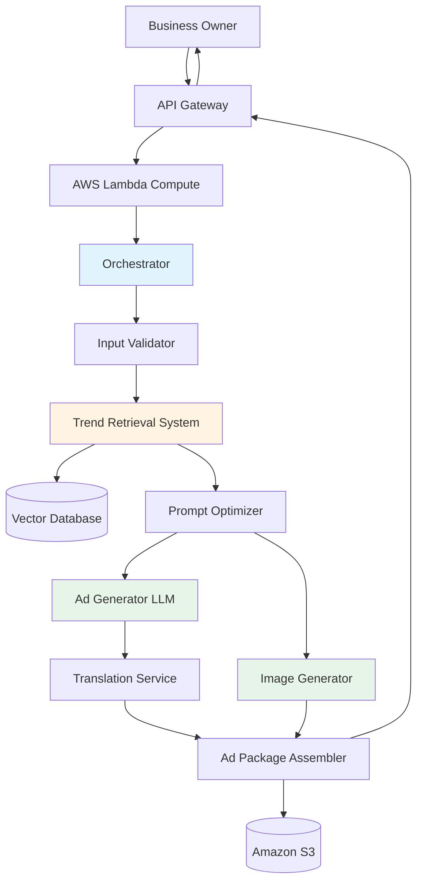

# Design Document: HyperLocal AI Content Engine

## Overview

The HyperLocal AI Content Engine is a cloud-native system that generates culturally relevant, multilingual marketing content for small businesses across India. The platform uses Amazon Bedrock foundation models combined with a Retrieval-Augmented Generation (RAG) pipeline to produce localized ad packages tailored to specific cities, languages, and audiences.

The system processes user input through validation, contextual enrichment, prompt optimization, parallel AI generation, and packaging stages, delivering complete marketing assets within ~30 seconds.

Built entirely on AWS managed services, the platform is designed for scalability, reliability, and production deployment from day one.

### Key Design Decisions

1. **Cloud-Native First Design**: Uses fully managed AWS services to minimize operational overhead and maximize scalability.
2. **Hyper-Local Intelligence**: RAG retrieves city-specific cultural trends and festivals.
3. **Parallel Generation**: Text and image assets generated simultaneously to reduce latency.
4. **Graceful Degradation**: System continues operating even if optional components fail.
5. **Prompt Optimization Layer**: Improves output quality and localization accuracy.
6. Scalable Microservices — Each module can scale independently.

## Architecture

## AWS Service

| System Component | AWS Service Used | Purpose |
|------------------|------------------|--------|
| API Layer | Amazon API Gateway | Request routing & rate limiting |
| Compute | AWS Lambda | Serverless orchestration logic |
| AI Models | Amazon Bedrock | Text, image, and multilingual generation |
| Vector Search | Bedrock Knowledge Base / OpenSearch | Trend retrieval (RAG) |
| Storage | Amazon S3 | Store generated ads and assets |
| Logging | Amazon CloudWatch | Monitoring and debugging |
| Authentication | AWS IAM | Secure access control |
| Caching | Amazon ElastiCache (optional) | Fast trend retrieval |

### Execution Stages

1. **Input Phase**: User submits product details, city, and language through API Gateway
2. **Validation Phase**: Input Validator checks format, size limits, and supported values
3. **Enrichment Phase**: Trend Retrieval System fetches hyper-local context from Vector Database
4. **Optimization Phase**: Prompt Optimizer enhances prompts with context and language-specific instructions
5. **Generation Phase**: Ad Generator and Image Generator work in parallel
6. **Translation Phase**: Translation Service processes text content if needed
7. **Assembly Phase**: Ad Package Assembler combines all outputs and uploads to storage
8. **Delivery Phase**: API returns download links and preview data to user

## Core Components

### 1. API Gateway

Handles authentication, request validation, and rate limiting before forwarding requests to processing services.

### 2. Content Orchestrator

Coordinates the entire pipeline:
1. validation
2. context retrieval
3. prompt building
3. generation
4. packaging

Implements retry logic and fallback strategies.

### 3. Input Validator
Validates all user inputs against requirements and supported configurations.

### 4. Trend Retrieval System (RAG)
Fetches relevant local context including:
1. festivals
2. regional trends
3. cultural tone
4. visual preferences
Uses vector similarity search to retrieve the most relevant city-specific data.

### 5. Prompt Optimizer
Enhances prompts with:
1. local cultural context
2. tone instructions
3. formatting rules
4. language specifications
Ensures higher quality and consistent AI outputs.

### 6. AI Generation Layer(Bedrock)
Handles content creation using dynamically selected foundation models.

Generates:
1. captions
2. ad copy
3. hashtags
4. voice scripts
5. posters

Model selection adapts based on:
1. language
2. content type
3. latency requirements

### 7. Translation Engine
If content is not produced in the target language, translation is performed using Bedrock multilingual models while preserving:
1. brand names
2. tone
3. marketing intent

### 8. Packaging Service
Combines generated assets and uploads them to Amazon S3.

Returns:
1. downloadable assets
2. preview content
3. metadata

### 9. Data Model Summary
The system manages structured data for:
1. supported languages
2. cities
3. trends
4. cultural preferences
5.generated assets
6. request logs

## Reliability & Fault Tolerance
The system ensures stability through:
1. retry logic with exponential backoff
2. partial result delivery if one component fails
3. fallback context when trend retrieval fails
4. circuit breaker protection for external services

This guarantees the user receives results even during partial outages.

**Assembly Process**:
1. Upload generated poster and assets to Amazon S3 with secure signed URLs
2. Create text file with all text content
3. Generate preview thumbnails
4. Create metadata file for tracking
5. Return URLs and content in structured format

## Graceful Degradation:
- Trend Retrieval fails → Use generic context
- Image Generation fails → Provide text-only option
- Translation fails → Return content in English with error note
- Single component fails → Return partial Ad_Package with error details

## Testing Strategy
System reliability is validated using:
1. input validation tests
2. API integration tests
3. multilingual output verification
4. failure simulation tests
5. load testing

Monitoring dashboards track:
1. error rate
2. latency
3. success rate
4. component failures
